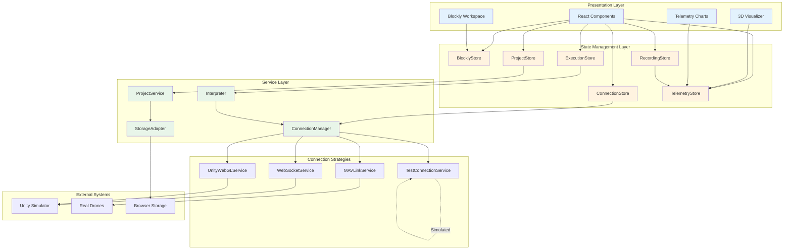
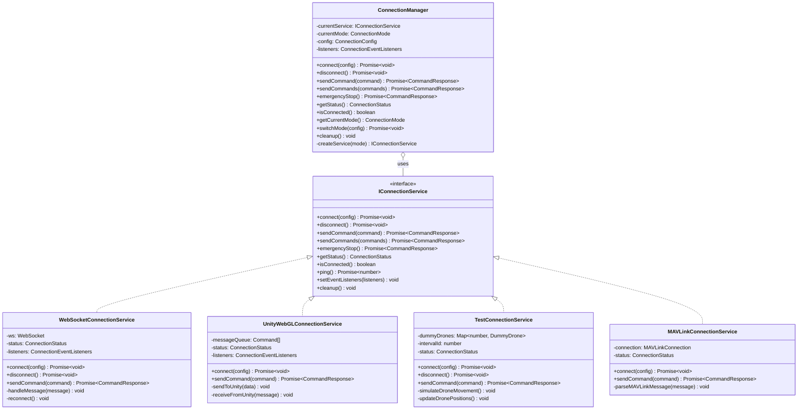
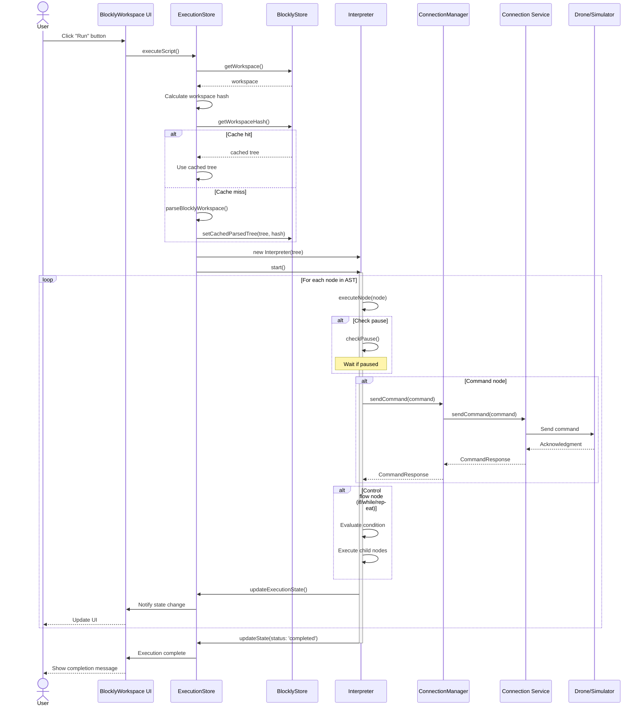
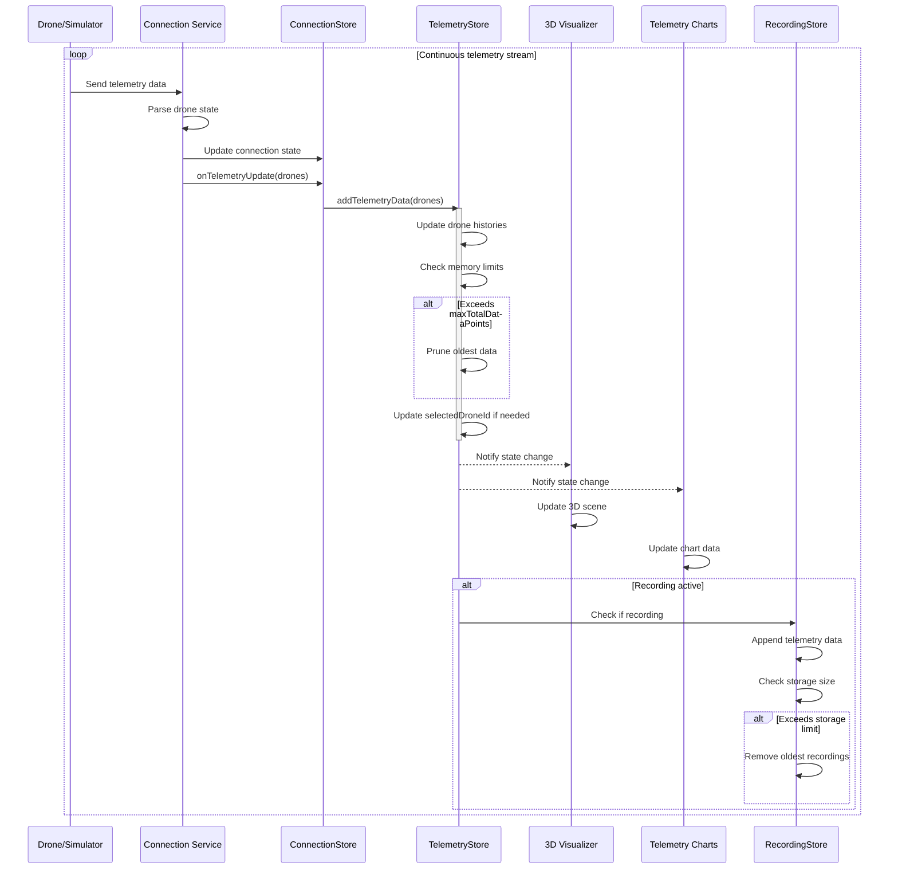
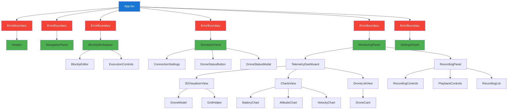
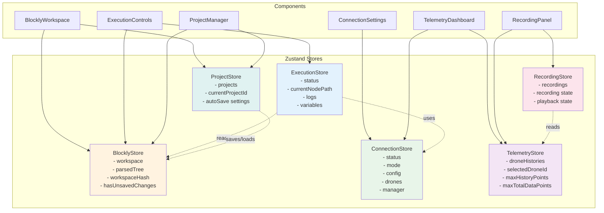
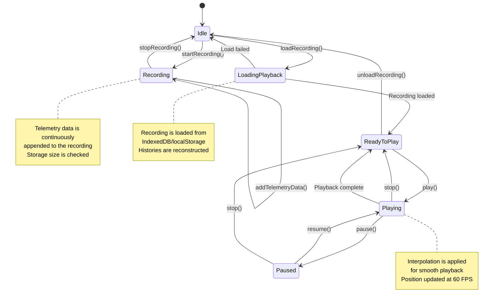
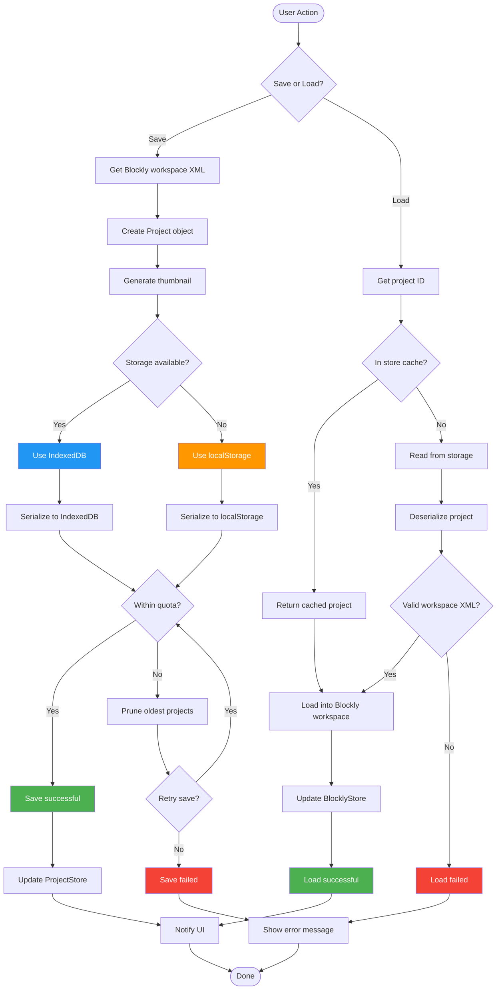
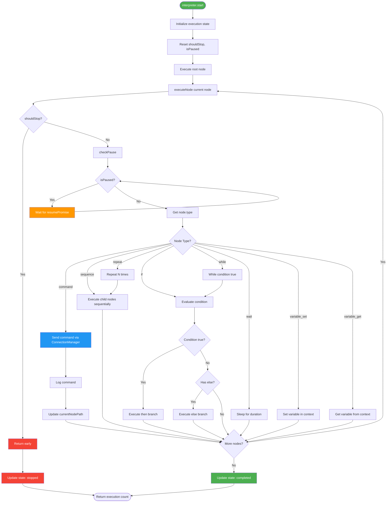
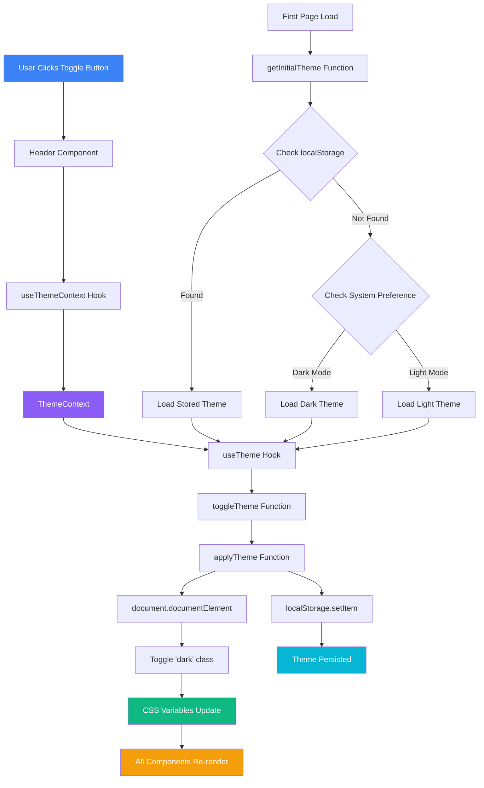

# System Diagrams

This document contains visual diagrams for understanding the Drone Swarm GCS architecture using Mermaid notation.

## Table of Contents

- [System Architecture Overview](#system-architecture-overview)
- [Connection Strategy Pattern](#connection-strategy-pattern)
- [Execution Flow](#execution-flow)
- [Telemetry Data Flow](#telemetry-data-flow)
- [Component Hierarchy](#component-hierarchy)
- [State Management](#state-management)
- [Flight Recording Flow](#flight-recording-flow)
- [Project Storage Flow](#project-storage-flow)

---

## System Architecture Overview

High-level view of the system architecture showing major modules and their interactions.

---

## Connection Strategy Pattern

UML class diagram showing the Strategy Pattern implementation for connection services.

---

## Execution Flow

Sequence diagram showing the complete execution flow from user action to drone commands.

---

## Telemetry Data Flow

Sequence diagram showing how telemetry data flows from drones to UI components.

---

## Component Hierarchy

Tree diagram showing the React component hierarchy with Error Boundary placement.

---

## State Management

Diagram showing all Zustand stores and their relationships.

---

## Flight Recording Flow

State machine diagram for flight recording and playback.

---

## Project Storage Flow

Flowchart showing project save/load operations with error handling.

---

## Execution Pipeline

Detailed flowchart of the Interpreter execution pipeline with pause/resume.

---

## 10. Theme System Data Flow

Shows how theme state flows from user interaction through Context to CSS variables.

**Key Points**:
- Theme toggle triggers re-render only in components using `useThemeContext`
- CSS variables handle all visual updates (no component re-renders for colors)
- localStorage ensures theme persists across sessions
- System preference detected on first load if no saved preference

---

## Notes

- All diagrams are rendered using Mermaid syntax
- For best viewing experience, use a Markdown viewer that supports Mermaid (e.g., GitHub, GitLab, VS Code with Mermaid extension)
- These diagrams complement the detailed text documentation in [ARCHITECTURE.md](../ARCHITECTURE.md)
- Diagrams are kept up-to-date with code changes during major refactoring

## Related Documentation

- [ARCHITECTURE.md](../ARCHITECTURE.md) - Comprehensive architecture documentation
- [API.md](./API.md) - API reference for stores and services
- [CONTRIBUTING.md](./CONTRIBUTING.md) - Development guidelines
- [README.md](../README.md) - Project overview and quick start
