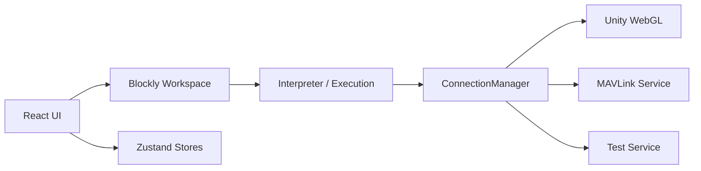
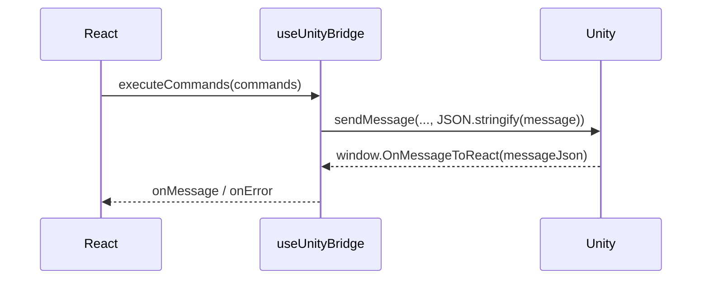
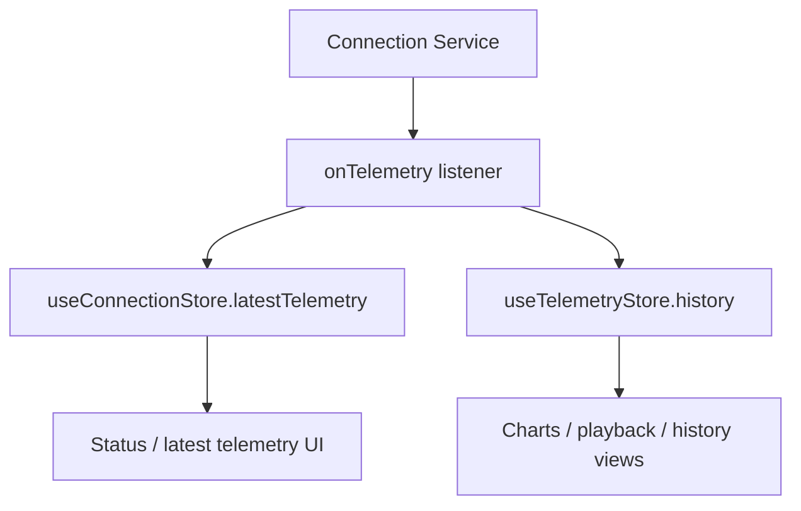

# Diagrams

## Runtime Overview

## Unity Embedded Bridge

## Telemetry Flow

## Notes
- Unity 경로는 임베드 브리지 기준
- `ConnectionManager`의 현재 연결 모델은 `Unity WebGL`, `MAVLink Service`, `Test Service`
- 브리지 서버는 MAVLink 경로 지원용으로만 사용
- 상세 구현 이력은 `docs/archive/` 참고
