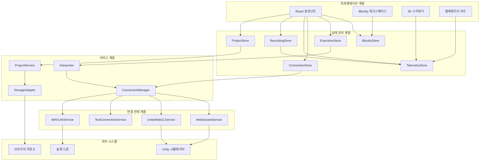
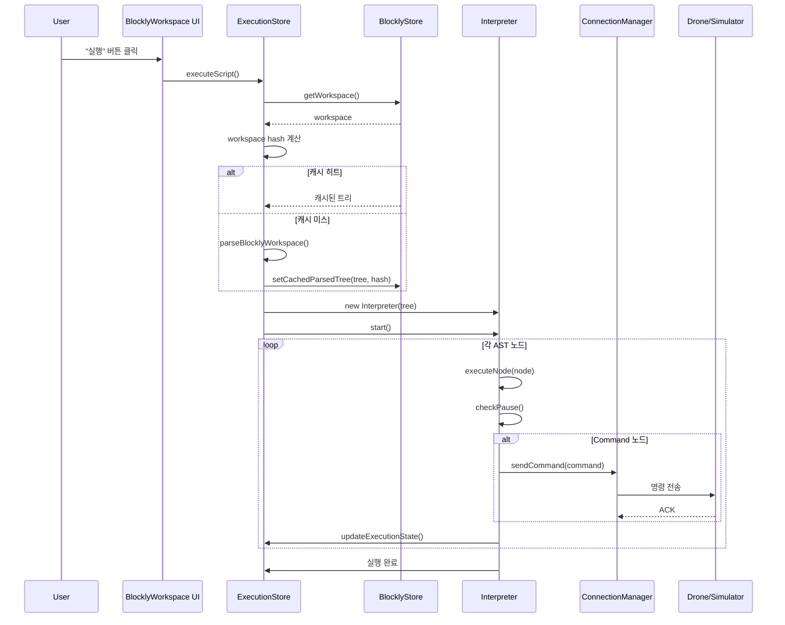

# 드론 군집 제어 지상 관제 시스템 (Drone Swarm GCS)

## 연구노트

---

## 연구 정보

| 항목 | 내용 |
|------|------|
| **연구 제목** | 시각적 프로그래밍 기반 드론 군집 제어 지상 관제 시스템 개발 |
| **연구 기간** | 2025년 10월 20일 ~ 현재 (진행 중) |
| **현재 상태** | Phase 2 완료, Phase 3 계획 단계 |
| **최종 업데이트** | 2025년 11월 25일 |
| **코드베이스** | 22,031줄 (TypeScript/TSX), 104개 파일 |
| **브랜치** | feature/phase2-mavlink |

---

## 목차

1. [연구 개요](#1-연구-개요)
2. [시스템 아키텍처](#2-시스템-아키텍처)
3. [핵심 기술 구현](#3-핵심-기술-구현)
4. [Phase 1 개발 상세](#4-phase-1-개발-상세)
5. [Phase 2 개발 상세](#5-phase-2-개발-상세)
6. [성능 최적화](#6-성능-최적화)
7. [테스트 및 검증](#7-테스트-및-검증)
8. [기술적 도전과 해결](#8-기술적-도전과-해결)
9. [향후 연구 계획](#9-향후-연구-계획)
10. [결론](#10-결론)

---

## 1. 연구 개요

### 1.1 연구 목적

본 연구는 비전문가도 쉽게 드론 군집을 제어할 수 있는 시각적 프로그래밍 기반 지상 관제 시스템(Ground Control Station, GCS)을 개발하는 것을 목표로 한다. Google Blockly를 활용한 블록 기반 프로그래밍 인터페이스를 통해 복잡한 드론 군집 비행 시나리오를 직관적으로 구성하고 실행할 수 있는 웹 기반 플랫폼을 구현한다.

### 1.2 연구 배경 및 필요성

#### 1.2.1 드론 군집 기술의 발전

드론 기술의 급속한 발전과 함께 군집 드론(Drone Swarm)의 활용 분야가 확대되고 있다:

- **농업**: 정밀 농업, 방제 작업, 작물 모니터링
- **물류**: 배송, 재고 관리, 창고 운영
- **수색 구조**: 재난 현장 탐색, 인명 구조 지원
- **엔터테인먼트**: 드론 라이트쇼, 공연
- **건설/측량**: 3D 매핑, 건설 현장 모니터링

#### 1.2.2 기존 시스템의 한계

현재 드론 제어 시스템들은 다음과 같은 한계를 가진다:

1. **높은 진입 장벽**: 전문 프로그래밍 지식 요구
2. **복잡한 인터페이스**: 직관적이지 않은 사용자 경험
3. **제한된 확장성**: 특정 드론/플랫폼에 종속
4. **부족한 시각화**: 실시간 모니터링 기능 부재

#### 1.2.3 본 연구의 차별점

| 기존 시스템 | 본 연구 시스템 |
|-------------|----------------|
| 코드 기반 프로그래밍 | 시각적 블록 프로그래밍 |
| 단일 드론 제어 | 군집 드론 동시 제어 |
| 2D 상태 표시 | 3D 실시간 시각화 |
| 로컬 앱 설치 필요 | 웹 브라우저 기반 |
| 제한된 프로토콜 | MAVLink 표준 프로토콜 지원 |

### 1.3 연구 범위 및 목표

#### 1.3.1 주요 연구 목표

1. **시각적 프로그래밍 환경 구축**: Blockly 기반 29개 커스텀 블록 개발
2. **실시간 모니터링 시스템**: Three.js 3D 시각화 및 텔레메트리 차트
3. **다중 연결 모드 지원**: 시뮬레이션, 실제 드론 연결
4. **MAVLink 프로토콜 통합**: 표준 드론 통신 프로토콜 지원
5. **비행 기록/재생 시스템**: 분석 및 학습을 위한 녹화 기능

#### 1.3.2 기대 효과

- 드론 프로그래밍 교육의 접근성 향상
- 드론 군집 알고리즘 연구 및 프로토타이핑 시간 단축
- 실제 드론 연동을 통한 현장 적용 가능성 확보

---

## 2. 시스템 아키텍처

### 2.1 전체 시스템 구조

시스템은 4개의 계층으로 구성된 클린 아키텍처를 따른다:



### 2.2 핵심 기술 스택

#### 2.2.1 프론트엔드 코어

| 기술 | 버전 | 선택 이유 |
|------|------|-----------|
| **React** | 19.2.0 | 최신 Concurrent Mode, Suspense 지원 |
| **TypeScript** | 5.9.3 | 타입 안전성, IDE 지원 |
| **Vite** | 7.2.2 | 빠른 HMR, 최적화된 빌드 |
| **TailwindCSS** | 4.x | CSS 변수 기반 테마 시스템 |

#### 2.2.2 상태 관리

| 라이브러리 | 버전 | 선택 이유 |
|------------|------|-----------|
| **Zustand** | 5.0.8 | 경량, 보일러플레이트 최소화, React 19 호환 |

**Zustand 선택 근거**:
- Redux 대비 70% 적은 코드량
- TypeScript 네이티브 지원
- 구독 기반 반응성
- DevTools 지원

#### 2.2.3 시각화 라이브러리

| 라이브러리 | 버전 | 용도 |
|------------|------|------|
| **Blockly** | 12.3.1 | 시각적 프로그래밍 |
| **Three.js** | 0.181.1 | 3D 렌더링 |
| **React Three Fiber** | 9.4.0 | Three.js React 바인딩 |
| **React Three Drei** | 10.7.6 | Three.js 헬퍼 |
| **Chart.js** | 4.5.1 | 텔레메트리 차트 |

### 2.3 디자인 패턴

시스템에 적용된 주요 디자인 패턴과 그 구현:

#### 2.3.1 Strategy Pattern (연결 관리)

**목적**: 런타임에 연결 전략을 동적으로 전환

**구현**:
```typescript
// IConnectionService 인터페이스
interface IConnectionService {
  connect(config: ConnectionConfig): Promise<void>
  disconnect(): Promise<void>
  sendCommand(command: Command): Promise<CommandResponse>
  getStatus(): ConnectionStatus
  isConnected(): boolean
  setEventListeners(listeners: ConnectionEventListeners): void
  cleanup(): void
}

// ConnectionManager (Singleton)
class ConnectionManager {
  private currentService: IConnectionService | null = null
  private currentMode: ConnectionMode | null = null

  async connect(config: ConnectionConfig): Promise<void> {
    this.currentService = this.createService(config.mode)
    await this.currentService.connect(config)
  }

  private createService(mode: ConnectionMode): IConnectionService {
    switch (mode) {
      case ConnectionMode.SIMULATION:
        return new WebSocketConnectionService()
      case ConnectionMode.UNITY_WEBGL:
        return new UnityWebGLConnectionService()
      case ConnectionMode.TEST:
        return new TestConnectionService()
      case ConnectionMode.MAVLINK_SIM:
      case ConnectionMode.REAL_DRONE:
        return new MAVLinkConnectionService()
    }
  }
}
```

**이점**:
- 새 연결 타입 추가 시 기존 코드 수정 불필요
- 클라이언트 코드 변경 없이 모드 전환 가능
- 관심사 분리로 테스트 용이

#### 2.3.2 Interpreter Pattern (실행 엔진)

**목적**: Blockly 시각 프로그램을 실행

**구현 흐름**:
```
Blockly Workspace → blocklyParser → ExecutableNode AST → Interpreter → Commands
```

**ExecutableNode 타입**:
```typescript
type ExecutableNode =
  | CommandNode       // 단일 명령 (이륙, 착륙, 이동)
  | SequenceNode      // 순차 실행
  | RepeatNode        // 고정 횟수 반복
  | ForLoopNode       // For 루프 (변수 포함)
  | WhileLoopNode     // 조건 기반 반복
  | UntilLoopNode     // 조건 충족까지 반복
  | IfNode            // 조건부 실행
  | IfElseNode        // If-Else 분기
  | WaitNode          // 지연 실행
  | VariableSetNode   // 변수 설정
  | VariableGetNode   // 변수 읽기
  | FunctionDefNode   // 함수 정의
  | FunctionCallNode  // 함수 호출
```

#### 2.3.3 Observer Pattern (상태 관리)

**목적**: 반응형 UI 업데이트

**Zustand 구현**:
```typescript
// 스토어 정의
const useTelemetryStore = create<TelemetryStore>((set, get) => ({
  droneHistories: new Map(),
  selectedDroneId: null,

  addTelemetryData: (drones) => {
    set((state) => {
      const newHistories = new Map(state.droneHistories)
      // 데이터 추가 로직
      return { droneHistories: newHistories }
    })
  },
}))

// 컴포넌트에서 구독
function DroneChart() {
  const droneHistories = useTelemetryStore((state) => state.droneHistories)
  // 자동 재렌더링
}
```

#### 2.3.4 Adapter Pattern (저장소)

**목적**: 저장소 백엔드 추상화

**구현**:
```typescript
// IndexedDBAdapter (Primary)
class IndexedDBAdapter implements IStorageAdapter {
  async save<T>(key: string, data: T): Promise<void> { /* ... */ }
  async load<T>(key: string): Promise<T | null> { /* ... */ }
}

// LocalStorageAdapter (Fallback)
class LocalStorageAdapter implements IStorageAdapter {
  async save<T>(key: string, data: T): Promise<void> { /* ... */ }
  async load<T>(key: string): Promise<T | null> { /* ... */ }
}

// 자동 폴백
const storage = indexedDBAvailable
  ? new IndexedDBAdapter()
  : new LocalStorageAdapter()
```

### 2.4 디렉토리 구조

```
drone-swarm-gcs/
├── src/
│   ├── components/              # React 컴포넌트 (30개)
│   │   ├── blockly/             # Blockly 워크스페이스 & 실행 UI
│   │   │   ├── BlocklyWorkspace.tsx
│   │   │   ├── ExecutionPanel.tsx
│   │   │   ├── blocks/          # 커스텀 블록 정의
│   │   │   │   └── swarmBlocks.ts (29개 블록)
│   │   │   └── generators/      # 코드 생성기
│   │   │       └── swarmGenerator.ts
│   │   ├── common/              # 재사용 UI 컴포넌트
│   │   │   ├── Button.tsx       # variant, size 지원
│   │   │   ├── Card.tsx
│   │   │   ├── Input.tsx
│   │   │   ├── ErrorBoundary.tsx
│   │   │   └── ErrorFallback.tsx
│   │   ├── connection/          # 연결 상태 표시
│   │   ├── layout/              # 레이아웃 패널
│   │   │   ├── Header.tsx
│   │   │   ├── NavigationPanel.tsx
│   │   │   ├── SimulatorPanel.tsx
│   │   │   ├── MonitoringPanel.tsx
│   │   │   └── SettingsPanel.tsx
│   │   ├── project/             # 프로젝트 관리 UI
│   │   ├── simulator/           # Unity WebGL 통합
│   │   └── visualization/       # 텔레메트리 시각화
│   │       ├── Drone3DView.tsx  # Three.js 3D 뷰
│   │       ├── BatteryChart.tsx
│   │       ├── AltitudeChart.tsx
│   │       ├── VelocityChart.tsx
│   │       ├── DroneStatus.tsx
│   │       ├── FlightPathLine.tsx
│   │       ├── RecordingPanel.tsx
│   │       └── PlaybackControls.tsx
│   │
│   ├── stores/                  # Zustand 상태 관리 (6개)
│   │   ├── useBlocklyStore.ts       # 워크스페이스, 명령, 캐시
│   │   ├── useConnectionStore.ts    # 연결 상태, 모드
│   │   ├── useExecutionStore.ts     # 인터프리터, 실행 상태
│   │   ├── useTelemetryStore.ts     # 드론 텔레메트리 히스토리
│   │   ├── useFlightRecordingStore.ts # 녹화 & 재생
│   │   └── useProjectStore.ts       # 프로젝트 CRUD
│   │
│   ├── services/                # 비즈니스 로직 (26개)
│   │   ├── connection/          # Strategy Pattern 구현
│   │   │   ├── ConnectionManager.ts      # Singleton 매니저
│   │   │   ├── IConnectionService.ts     # 인터페이스
│   │   │   ├── WebSocketConnectionService.ts
│   │   │   ├── UnityWebGLConnectionService.ts
│   │   │   ├── TestConnectionService.ts
│   │   │   ├── MAVLinkConnectionService.ts
│   │   │   └── DroneSimulator.ts
│   │   ├── execution/           # Interpreter Pattern
│   │   │   ├── blocklyParser.ts (537줄)
│   │   │   ├── interpreter.ts (600+줄)
│   │   │   └── conditionEvaluator.ts
│   │   ├── mavlink/             # MAVLink 프로토콜
│   │   │   ├── MAVLinkProtocol.ts
│   │   │   ├── MAVLinkCommands.ts
│   │   │   ├── MAVLinkConverter.ts
│   │   │   └── CoordinateConverter.ts
│   │   └── storage/             # Adapter Pattern
│   │       ├── projectStorage.ts
│   │       ├── indexedDBAdapter.ts
│   │       └── localStorageAdapter.ts
│   │
│   ├── types/                   # TypeScript 타입 정의 (9개)
│   │   ├── blockly.ts
│   │   ├── execution.ts
│   │   ├── telemetry.ts
│   │   ├── websocket.ts
│   │   ├── mavlink.ts
│   │   ├── project.ts
│   │   └── unity.ts
│   │
│   ├── constants/               # 상수 정의
│   ├── utils/                   # 유틸리티 함수
│   ├── hooks/                   # 커스텀 React Hooks
│   ├── i18n/                    # 국제화 (한국어/영어)
│   ├── contexts/                # React Context (Theme)
│   ├── __tests__/               # 테스트 스위트 (6개)
│   ├── App.tsx                  # 메인 앱 컴포넌트
│   └── main.tsx                 # React 진입점
│
├── docs/                        # 문서 (7개, 1,500+줄)
│   ├── ARCHITECTURE.md          # 시스템 아키텍처
│   ├── API.md                   # API 레퍼런스
│   ├── DIAGRAMS.md              # Mermaid 다이어그램
│   ├── CONTRIBUTING.md          # 기여 가이드
│   ├── CODING_RULES.md          # 코딩 규칙
│   ├── DEBUG_GUIDE.md           # 디버깅 가이드
│   └── DEVELOPMENT_DIARY_30DAYS.md # 개발 일지
│
├── package.json                 # 의존성
├── vite.config.ts               # 빌드 설정
├── tailwind.config.ts           # TailwindCSS 설정
└── tsconfig.json                # TypeScript 설정
```

---

## 3. 핵심 기술 구현

### 3.1 시각적 프로그래밍 (Blockly)

#### 3.1.1 커스텀 블록 시스템

총 29개의 커스텀 Blockly 블록을 4개 카테고리로 개발:

**기본 제어 블록 (8개)**:

| 블록 | 기능 | 파라미터 |
|------|------|----------|
| `swarm_takeoff_all` | 전체 이륙 | altitude |
| `swarm_land_all` | 전체 착륙 | - |
| `swarm_set_formation` | 대형 설정 | formationType, spacing |
| `swarm_move_formation` | 대형 이동 | direction, distance, speed |
| `swarm_move_drone` | 개별 드론 이동 | droneId, x, y, z, speed |
| `swarm_hover` | 호버링 | duration |
| `swarm_wait` | 대기 | seconds |
| `swarm_sync_all` | 동기화 | - |

**제어 흐름 블록 (6개)**:

| 블록 | 기능 | 특징 |
|------|------|------|
| `swarm_repeat` | N회 반복 | 고정 횟수 |
| `swarm_for` | For 루프 | 변수, from/to/by |
| `swarm_while` | While 루프 | 조건 기반, 최대 1000회 |
| `swarm_until` | Until 루프 | do-while 스타일 |
| `swarm_if` | 조건문 | 단일 분기 |
| `swarm_if_else` | 조건문 | 양방향 분기 |

**미션 블록 (4개)** - Phase 2 추가:

| 블록 | 기능 | 파라미터 |
|------|------|----------|
| `swarm_add_waypoint` | 웨이포인트 추가 | name, x, y, z, speed, waitTime |
| `swarm_goto_waypoint` | 웨이포인트 이동 | waypointName |
| `swarm_execute_mission` | 미션 실행 | loop (boolean) |
| `swarm_clear_waypoints` | 웨이포인트 초기화 | - |

**고급 블록 (11개)**:
- 변수: `variable_get`, `variable_set`
- 함수: `function_def`, `function_call`
- 수학: `math_number`, `math_arithmetic`
- 논리: `logic_compare`, `logic_operation`, `logic_negate`
- 센서: `sensor_condition`

#### 3.1.2 블록 정의 예시

```typescript
// swarmBlocks.ts
Blockly.defineBlocksWithJsonArray([
  {
    type: 'swarm_set_formation',
    message0: '대형 설정 %1 간격 %2m',
    args0: [
      {
        type: 'field_dropdown',
        name: 'FORMATION',
        options: [
          ['일렬', 'LINE'],
          ['격자', 'GRID'],
          ['원형', 'CIRCLE'],
          ['V자', 'V_SHAPE'],
          ['삼각형', 'TRIANGLE'],
          ['정사각형', 'SQUARE'],
          ['마름모', 'DIAMOND'],
        ],
      },
      {
        type: 'field_number',
        name: 'SPACING',
        value: 2,
        min: 0.5,
        max: 10,
      },
    ],
    previousStatement: null,
    nextStatement: null,
    colour: 160,
    tooltip: '드론 군집의 대형을 설정합니다',
    helpUrl: '',
  },
])
```

#### 3.1.3 코드 생성기

```typescript
// swarmGenerator.ts
javascriptGenerator.forBlock['swarm_set_formation'] = function (
  block: Blockly.Block
) {
  const formation = block.getFieldValue('FORMATION')
  const spacing = block.getFieldValue('SPACING')

  return JSON.stringify({
    action: 'SET_FORMATION',
    params: {
      formationType: formation,
      spacing: Number(spacing),
    },
    targetDrones: 'ALL',
  }) + ',\n'
}
```

### 3.2 대형 시스템

#### 3.2.1 7가지 대형 패턴

각 대형의 배치 알고리즘:

**LINE (일렬)**:
```typescript
function calculateLineFormation(droneCount: number, spacing: number): Position[] {
  const positions: Position[] = []
  const startX = -((droneCount - 1) * spacing) / 2

  for (let i = 0; i < droneCount; i++) {
    positions.push({
      x: startX + i * spacing,
      y: 0,
      z: 0,
    })
  }
  return positions
}
```

**CIRCLE (원형)**:
```typescript
function calculateCircleFormation(droneCount: number, spacing: number): Position[] {
  const positions: Position[] = []
  const radius = (spacing * droneCount) / (2 * Math.PI)

  for (let i = 0; i < droneCount; i++) {
    const angle = (2 * Math.PI * i) / droneCount
    positions.push({
      x: radius * Math.cos(angle),
      y: radius * Math.sin(angle),
      z: 0,
    })
  }
  return positions
}
```

**TRIANGLE (삼각형)** - Phase 2:
```typescript
function calculateTriangleFormation(droneCount: number, spacing: number): Position[] {
  const positions: Position[] = []
  let row = 0
  let dronesPlaced = 0

  while (dronesPlaced < droneCount) {
    const dronesInRow = row + 1
    const startX = -(row * spacing) / 2

    for (let i = 0; i < dronesInRow && dronesPlaced < droneCount; i++) {
      positions.push({
        x: startX + i * spacing,
        y: -row * spacing * Math.sin(Math.PI / 3),
        z: 0,
      })
      dronesPlaced++
    }
    row++
  }
  return positions
}
```

**DIAMOND (마름모)** - Phase 2:
```typescript
function calculateDiamondFormation(droneCount: number, spacing: number): Position[] {
  const positions: Position[] = []
  const perSide = Math.ceil(droneCount / 4)
  const halfSize = (perSide * spacing) / 2

  // 4변에 균등 분배
  const sides = [
    { start: { x: 0, y: halfSize }, dir: { x: 1, y: -1 } },    // 우상
    { start: { x: halfSize, y: 0 }, dir: { x: -1, y: -1 } },   // 우하
    { start: { x: 0, y: -halfSize }, dir: { x: -1, y: 1 } },   // 좌하
    { start: { x: -halfSize, y: 0 }, dir: { x: 1, y: 1 } },    // 좌상
  ]

  let placed = 0
  for (let s = 0; s < 4 && placed < droneCount; s++) {
    const side = sides[s]
    for (let i = 0; i < perSide && placed < droneCount; i++) {
      positions.push({
        x: side.start.x + side.dir.x * i * spacing / Math.sqrt(2),
        y: side.start.y + side.dir.y * i * spacing / Math.sqrt(2),
        z: 0,
      })
      placed++
    }
  }
  return positions
}
```

### 3.3 실행 엔진 (Interpreter)

#### 3.3.1 파싱 프로세스

Blockly 워크스페이스를 실행 가능한 AST로 변환:



#### 3.3.2 일시정지/재개 메커니즘

Promise 기반 일시정지/재개 구현:

```typescript
class Interpreter {
  private isPaused: boolean = false
  private resumePromise: Promise<void> | null = null
  private resumeResolver: (() => void) | null = null

  pause(): void {
    this.isPaused = true
    this.resumePromise = new Promise(resolve => {
      this.resumeResolver = resolve
    })
    this.updateState({ status: 'paused' })
  }

  resume(): void {
    this.isPaused = false
    this.resumeResolver?.()
    this.resumePromise = null
    this.updateState({ status: 'running' })
  }

  private async checkPause(): Promise<void> {
    if (this.isPaused && this.resumePromise) {
      await this.resumePromise
    }
  }

  private async executeNode(node: ExecutableNode): Promise<void> {
    if (this.shouldStop) return
    await this.checkPause()

    switch (node.type) {
      case 'command':
        await this.executeCommand(node)
        break
      case 'sequence':
        for (const child of node.children) {
          await this.executeNode(child)
        }
        break
      case 'repeat':
        for (let i = 0; i < node.count; i++) {
          this.context.currentRepeatCount = i + 1
          await this.executeNode(node.body)
        }
        break
      // ... 기타 노드 타입
    }
  }
}
```

#### 3.3.3 실행 컨텍스트

변수, 함수, 호출 스택 관리:

```typescript
interface ExecutionContext {
  variables: Map<string, number>      // 변수 값
  functions: Map<string, ExecutableNode>  // 함수 정의
  callStack: string[]                 // 재귀 감지 (최대 10)
  currentRepeatCount?: number
  currentLoopVariable?: { name: string; value: number }
  executionStartTime?: number
}
```

### 3.4 연결 시스템

#### 3.4.1 5가지 연결 모드

| 모드 | 용도 | 통신 방식 | 특징 |
|------|------|-----------|------|
| **TEST** | 단독 테스트 | 메모리 | 외부 의존성 없음, 즉각 응답 |
| **SIMULATION** | Unity 연동 | WebSocket | 재연결 로직, 메시지 큐 |
| **UNITY_WEBGL** | 내장 시뮬레이터 | SendMessage | 네트워크 지연 없음 |
| **MAVLINK_SIM** | 프로토콜 테스트 | MAVLink | 4대 시뮬레이션 드론 |
| **REAL_DRONE** | 실제 운용 | UDP/Serial | GPS↔NED 좌표 변환 |

#### 3.4.2 WebSocket 연결 서비스

```typescript
class WebSocketConnectionService implements IConnectionService {
  private ws: WebSocket | null = null
  private reconnectAttempts: number = 0
  private maxReconnectAttempts: number = 3
  private reconnectInterval: number = 3000

  async connect(config: ConnectionConfig): Promise<void> {
    return new Promise((resolve, reject) => {
      this.ws = new WebSocket(config.websocket.url)

      this.ws.onopen = () => {
        this.reconnectAttempts = 0
        this.listeners.onConnect?.()
        resolve()
      }

      this.ws.onclose = () => {
        this.handleDisconnect()
      }

      this.ws.onmessage = (event) => {
        const message = JSON.parse(event.data)
        this.handleMessage(message)
      }

      this.ws.onerror = (error) => {
        reject(error)
      }
    })
  }

  private handleDisconnect(): void {
    if (this.reconnectAttempts < this.maxReconnectAttempts) {
      this.reconnectAttempts++
      setTimeout(() => {
        this.connect(this.config!)
      }, this.reconnectInterval)
    } else {
      this.listeners.onDisconnect?.()
    }
  }

  async sendCommand(command: Command): Promise<CommandResponse> {
    if (!this.isConnected()) {
      throw new Error('Not connected')
    }

    this.ws!.send(JSON.stringify({
      type: 'COMMAND',
      payload: command,
    }))

    return { success: true }
  }
}
```

#### 3.4.3 Test Connection Service (드론 시뮬레이터)

```typescript
class TestConnectionService implements IConnectionService {
  private drones: Map<number, SimulatedDrone> = new Map()
  private telemetryInterval: number | null = null

  async connect(config: ConnectionConfig): Promise<void> {
    const droneCount = config.test?.droneCount || 4

    // 드론 초기화
    for (let i = 1; i <= droneCount; i++) {
      this.drones.set(i, {
        id: i,
        position: { x: 0, y: 0, z: 0 },
        rotation: { x: 0, y: 0, z: 0 },
        velocity: { x: 0, y: 0, z: 0 },
        battery: 100,
        status: 'idle',
        targetPosition: null,
        waypoints: [],
      })
    }

    // 100ms 간격 텔레메트리 전송 (10Hz)
    this.telemetryInterval = setInterval(() => {
      this.updateSimulation()
      this.emitTelemetry()
    }, 100)

    this.listeners.onConnect?.()
  }

  private updateSimulation(): void {
    for (const drone of this.drones.values()) {
      if (drone.targetPosition) {
        // 물리 시뮬레이션: 목표 위치로 이동
        const dx = drone.targetPosition.x - drone.position.x
        const dy = drone.targetPosition.y - drone.position.y
        const dz = drone.targetPosition.z - drone.position.z
        const distance = Math.sqrt(dx*dx + dy*dy + dz*dz)

        if (distance > 0.1) {
          const speed = drone.speed || 2 // m/s
          const step = Math.min(speed * 0.1, distance)

          drone.velocity = {
            x: (dx / distance) * speed,
            y: (dy / distance) * speed,
            z: (dz / distance) * speed,
          }

          drone.position.x += (dx / distance) * step
          drone.position.y += (dy / distance) * step
          drone.position.z += (dz / distance) * step
        } else {
          drone.targetPosition = null
          drone.velocity = { x: 0, y: 0, z: 0 }
        }

        // 배터리 소모 (비행 중 0.1%/초)
        drone.battery = Math.max(0, drone.battery - 0.01)
      }
    }
  }
}
```

### 3.5 MAVLink 프로토콜 구현

#### 3.5.1 MAVLink v2 패킷 구조

```typescript
interface MAVLinkPacket {
  magic: number           // 0xFD (v2)
  len: number            // 페이로드 길이
  incompat_flags: number // 비호환 플래그
  compat_flags: number   // 호환 플래그
  seq: number            // 시퀀스 번호
  sysid: number          // 시스템 ID
  compid: number         // 컴포넌트 ID
  msgid: number          // 메시지 ID (24비트)
  payload: Uint8Array    // 페이로드
  checksum: number       // CRC-16
}
```

#### 3.5.2 지원 메시지 타입

| 메시지 ID | 이름 | 용도 |
|-----------|------|------|
| 0 | HEARTBEAT | 연결 상태 확인 |
| 1 | SYS_STATUS | 시스템 상태 |
| 33 | GLOBAL_POSITION_INT | GPS 위치 |
| 30 | ATTITUDE | 자세 정보 |
| 76 | COMMAND_LONG | 명령 전송 |
| 84 | SET_POSITION_TARGET_LOCAL_NED | 위치 명령 |

#### 3.5.3 좌표 변환 (GPS ↔ NED)

```typescript
// GPS (위도/경도) → NED (로컬 좌표)
function gpsToNED(
  lat: number,
  lon: number,
  alt: number,
  refLat: number,
  refLon: number,
  refAlt: number
): { x: number; y: number; z: number } {
  const EARTH_RADIUS = 6371000 // 미터

  const dLat = (lat - refLat) * Math.PI / 180
  const dLon = (lon - refLon) * Math.PI / 180

  const x = dLat * EARTH_RADIUS  // North
  const y = dLon * EARTH_RADIUS * Math.cos(refLat * Math.PI / 180)  // East
  const z = -(alt - refAlt)  // Down (NED)

  return { x, y, z }
}

// NED → GPS
function nedToGPS(
  x: number,
  y: number,
  z: number,
  refLat: number,
  refLon: number,
  refAlt: number
): { lat: number; lon: number; alt: number } {
  const EARTH_RADIUS = 6371000

  const lat = refLat + (x / EARTH_RADIUS) * (180 / Math.PI)
  const lon = refLon + (y / (EARTH_RADIUS * Math.cos(refLat * Math.PI / 180))) * (180 / Math.PI)
  const alt = refAlt - z

  return { lat, lon, alt }
}
```

### 3.6 3D 시각화 (Three.js)

#### 3.6.1 React Three Fiber 통합

```typescript
// Drone3DView.tsx
function Drone3DView() {
  const drones = useConnectionStore((state) => state.drones)

  return (
    <Canvas camera={{ position: [20, 20, 20], fov: 60 }}>
      <ambientLight intensity={0.5} />
      <directionalLight position={[10, 10, 10]} intensity={1} />

      {/* 그리드 시스템 */}
      <gridHelper args={[100, 20, '#444', '#222']} />

      {/* 드론 렌더링 */}
      {drones.map((drone) => (
        <DroneModel key={drone.id} drone={drone} />
      ))}

      {/* 카메라 컨트롤 */}
      <OrbitControls
        enableDamping
        dampingFactor={0.05}
        minDistance={5}
        maxDistance={100}
      />
    </Canvas>
  )
}

// 드론 3D 모델
function DroneModel({ drone }: { drone: DroneState }) {
  const meshRef = useRef<THREE.Mesh>(null)

  // 애니메이션 프레임마다 위치 업데이트
  useFrame(() => {
    if (meshRef.current) {
      meshRef.current.position.set(
        drone.position.x,
        drone.position.z,  // Y-up 좌표계
        drone.position.y
      )
      meshRef.current.rotation.set(
        drone.rotation.x,
        drone.rotation.z,
        drone.rotation.y
      )
    }
  })

  // 배터리에 따른 색상
  const color = drone.battery > 50 ? '#00ff00' :
                drone.battery > 20 ? '#ffff00' : '#ff0000'

  return (
    <mesh ref={meshRef}>
      <coneGeometry args={[0.3, 1, 4]} />
      <meshStandardMaterial color={color} />

      {/* 드론 ID 라벨 */}
      <Text
        position={[0, 1.5, 0]}
        fontSize={0.3}
        color="white"
      >
        {drone.id}
      </Text>
    </mesh>
  )
}
```

#### 3.6.2 비행 경로 렌더링

```typescript
// FlightPathLine.tsx
function FlightPathLine({ droneId }: { droneId: number }) {
  const history = useTelemetryStore(
    (state) => state.droneHistories.get(droneId)
  )

  if (!history || history.dataPoints.length < 2) return null

  const points = history.dataPoints.map(
    (p) => new THREE.Vector3(p.position.x, p.position.z, p.position.y)
  )

  const lineGeometry = new THREE.BufferGeometry().setFromPoints(points)

  return (
    <line geometry={lineGeometry}>
      <lineBasicMaterial color="#00ffff" linewidth={2} />
    </line>
  )
}
```

### 3.7 비행 기록 및 재생

#### 3.7.1 녹화 시스템

```typescript
// useFlightRecordingStore.ts
interface FlightRecording {
  id: string
  name: string
  description?: string
  startTime: number
  endTime: number
  duration: number
  droneCount: number
  droneHistories: Map<number, DroneHistory>
  tags?: string[]
  createdAt: string
}

// 녹화 시작
startRecording: () => {
  set({
    isRecording: true,
    recordingStartTime: Date.now(),
    currentRecordingData: new Map(),
  })
},

// 녹화 저장 (5MB 제한)
saveRecording: (name, description, tags) => {
  const state = get()
  const recording: FlightRecording = {
    id: crypto.randomUUID(),
    name,
    description,
    startTime: state.recordingStartTime!,
    endTime: Date.now(),
    duration: Date.now() - state.recordingStartTime!,
    droneCount: state.currentRecordingData.size,
    droneHistories: state.currentRecordingData,
    tags,
    createdAt: new Date().toISOString(),
  }

  // 저장소 크기 관리
  const recordings = [...state.recordings, recording]
  const MAX_STORAGE_SIZE = 5 * 1024 * 1024  // 5MB

  while (estimateSize(recordings) > MAX_STORAGE_SIZE && recordings.length > 1) {
    recordings.shift()  // 가장 오래된 것 제거
  }

  set({ recordings, isRecording: false })
  localStorage.setItem('flight-recordings', JSON.stringify(recordings))
},
```

#### 3.7.2 재생 시스템 (선형 보간)

```typescript
// 현재 재생 시점의 드론 상태 계산
getCurrentPlaybackData: () => {
  const state = get()
  const { recording, currentTime } = state.playback

  if (!recording) return null

  const interpolatedData = new Map<number, DroneHistory>()

  for (const [droneId, history] of recording.droneHistories) {
    const points = history.dataPoints

    // 이진 탐색으로 현재 시점 주변 데이터 포인트 찾기
    let left = 0, right = points.length - 1
    while (left < right - 1) {
      const mid = Math.floor((left + right) / 2)
      if (points[mid].timestamp <= currentTime) {
        left = mid
      } else {
        right = mid
      }
    }

    const p1 = points[left]
    const p2 = points[right]

    // 선형 보간
    const t = (currentTime - p1.timestamp) / (p2.timestamp - p1.timestamp)
    const interpolated: DroneHistoryPoint = {
      timestamp: currentTime,
      position: {
        x: p1.position.x + (p2.position.x - p1.position.x) * t,
        y: p1.position.y + (p2.position.y - p1.position.y) * t,
        z: p1.position.z + (p2.position.z - p1.position.z) * t,
      },
      rotation: {
        x: p1.rotation.x + (p2.rotation.x - p1.rotation.x) * t,
        y: p1.rotation.y + (p2.rotation.y - p1.rotation.y) * t,
        z: p1.rotation.z + (p2.rotation.z - p1.rotation.z) * t,
      },
      velocity: {
        x: p1.velocity.x + (p2.velocity.x - p1.velocity.x) * t,
        y: p1.velocity.y + (p2.velocity.y - p1.velocity.y) * t,
        z: p1.velocity.z + (p2.velocity.z - p1.velocity.z) * t,
      },
      battery: p1.battery + (p2.battery - p1.battery) * t,
      status: p1.status,
    }

    interpolatedData.set(droneId, {
      droneId,
      dataPoints: [interpolated],
    })
  }

  return interpolatedData
},
```

---

## 4. Phase 1 개발 상세

**기간**: 2025년 10월 20일 ~ 11월 18일 (30일)

### 4.1 Week 1: 프로젝트 기반 구축

#### Day 1-2: 프로젝트 초기 설정

**작업 내용**:
- Vite + React 19 + TypeScript 5.9 프로젝트 생성
- 폴더 구조 설계 (components, services, stores, types)
- ESLint 9.x flat config 설정
- TailwindCSS 4.x 통합

**주요 결정**:
- **React 19 선택**: Concurrent Mode, Suspense 지원
- **Zustand 선택**: Redux 대비 경량, 보일러플레이트 최소화
- **Vite 선택**: CRA 대비 10배 빠른 HMR

#### Day 3-4: UI 컴포넌트 및 상태 관리

**공통 컴포넌트 라이브러리**:
- `Button`: variant (primary/secondary/danger), size (sm/md/lg)
- `Card`: 재사용 가능한 카드 컨테이너
- `Input`: 유효성 검사 지원 입력 필드
- `ErrorBoundary`: 6계층 에러 경계

**Zustand 스토어 구축**:
- `useBlocklyStore`: 워크스페이스, 명령, 캐시
- `useConnectionStore`: 연결 상태, 모드
- `useExecutionStore`: 인터프리터, 실행 상태

#### Day 5-7: Blockly 통합 및 WebSocket

**Blockly 통합**:
- 15개 초기 커스텀 블록 개발
- 4가지 대형 타입 (LINE, GRID, CIRCLE, V_SHAPE)
- 한국어 툴박스 라벨

**WebSocket 시스템**:
- 재연결 로직 (최대 3회)
- Ping/Pong 심박 체크 (30초)
- ConnectionManager Strategy 패턴

### 4.2 Week 2: 핵심 실행 엔진

#### Day 8-10: Interpreter 구현

**주요 구현**:
- AST 기반 실행 인터프리터 (600+줄)
- 일시정지/재개 (Promise 기반)
- TestConnectionService (4대 드론 시뮬레이션)
- Condition Evaluator (조건 평가기)

**지원 조건**:
- `all_connected`: 모든 드론 연결 확인
- `battery > N`: 배터리 레벨 조건
- `altitude < N`: 고도 조건
- `formation_complete`: 대형 완료 확인

#### Day 11-14: Unity 통합 및 제어 흐름

**Unity WebGL 통합**:
- React → Unity: `SendMessage` API
- Unity → React: `window.ReactReceiveMessage`
- 로딩 진행률 표시

**제어 흐름 구현**:
- Repeat N times
- For Loop (from/to/by)
- While Loop (최대 1000회)
- Repeat Until (do-while)
- 변수/함수 시스템

### 4.3 Week 3: 시각화 및 모니터링

#### Day 15-17: Three.js 3D 시각화

**구현 내용**:
- React Three Fiber 통합
- 드론 3D 모델 (원뿔 형상)
- OrbitControls (회전, 팬, 줌)
- 20×20 그리드 시스템

**텔레메트리 차트**:
- BatteryChart: 배터리 소모 추적
- AltitudeChart: 고도 변화
- VelocityChart: X/Y/Z 속도

#### Day 18-21: 비행 기록 시스템

**녹화 기능**:
- IndexedDB 저장 (5MB 제한)
- 메타데이터 관리 (이름, 설명, 태그)
- 자동 정리 (오래된 데이터 제거)

**재생 기능**:
- 선형 보간 (부드러운 60 FPS)
- 속도 조절 (0.5x ~ 2x)
- 타임라인 스크러빙

### 4.4 Week 4-5: 고급 기능 및 문서화

#### Day 22-28: 프로젝트 관리 및 MAVLink

**프로젝트 관리**:
- CRUD 작업 (IndexedDB + localStorage)
- 4가지 템플릿 (기본 비행, 대형 데모 등)
- 가져오기/내보내기 (JSON)

**MAVLink 프로토콜**:
- v2 프로토콜 파서 (CRC 검증)
- GPS ↔ NED 좌표 변환
- 4대 시뮬레이션 드론

#### Day 29-30: 문서화 및 테스트

**문서 작성** (1,500+줄):
- ARCHITECTURE.md: 아키텍처 상세
- API.md: 스토어/서비스 API
- CONTRIBUTING.md: 개발 워크플로우
- CODING_RULES.md: 코딩 규칙

**테스트 스위트**:
- interpreter.test.ts
- conditionEvaluator.test.ts
- MAVLinkProtocol.test.ts

### 4.5 Phase 1 성과 요약

| 항목 | 수치 |
|------|------|
| 총 코드량 | 21,668줄 |
| 컴포넌트 | 30개 |
| 서비스 | 26개 |
| 스토어 | 6개 |
| Blockly 블록 | 15개 |
| 대형 타입 | 4가지 |

---

## 5. Phase 2 개발 상세

**기간**: 2025년 11월 19일 ~ 11월 21일 (3일)

### 5.1 테마 시스템 구현

#### 5.1.1 아키텍처

**React Context + CSS 변수** 패턴:

```typescript
// ThemeContext.tsx
interface ThemeContextValue {
  theme: 'light' | 'dark'
  setTheme: (theme: Theme) => void
  toggle: () => void
  isDark: boolean
}

// useTheme.ts
export function useTheme() {
  const [theme, setTheme] = useState<Theme>(getInitialTheme)

  useEffect(() => {
    applyTheme(theme)
  }, [theme])

  const toggle = () => {
    setTheme((current) => toggleTheme(current))
  }

  return { theme, setTheme, toggle, isDark: theme === 'dark' }
}
```

#### 5.1.2 70+ CSS 변수 정의

**카테고리별 변수**:

```css
:root {
  /* 배경색 (6개) */
  --bg-primary: rgb(249 250 251);
  --bg-secondary: rgb(243 244 246);
  --bg-tertiary: rgb(229 231 235);
  --bg-hover: rgb(243 244 246);
  --bg-active: rgb(229 231 235);

  /* 텍스트 (4개) */
  --text-primary: rgb(17 24 39);
  --text-secondary: rgb(107 114 128);
  --text-tertiary: rgb(156 163 175);
  --text-inverted: rgb(255 255 255);

  /* 경계선 (3개) */
  --border-primary: rgb(229 231 235);
  --border-secondary: rgb(209 213 219);
  --border-focus: rgb(59 130 246);

  /* 상태 색상 (8개) */
  --status-online: rgb(34 197 94);
  --status-offline: rgb(156 163 175);
  --status-active: rgb(59 130 246);
  --status-idle: rgb(234 179 8);
  --status-armed: rgb(249 115 22);
  --status-error: rgb(239 68 68);
  --status-warning: rgb(234 179 8);
  --status-ok: rgb(34 197 94);

  /* 컴포넌트별 (50+개) */
  --badge-bg: rgb(243 244 246);
  --nav-bg: rgb(255 255 255);
  --tab-active: rgb(59 130 246);
  /* ... */
}

.dark {
  --bg-primary: rgb(17 24 39);
  --bg-secondary: rgb(31 41 55);
  --text-primary: rgb(243 244 246);
  /* ... */
}
```

#### 5.1.3 컴포넌트 적용

전체 30개 컴포넌트를 CSS 변수로 전환:

```typescript
// TailwindCSS 임의 값 문법
<div className="bg-[var(--bg-primary)] text-[var(--text-primary)] border-[var(--border-primary)]">
  Content
</div>
```

### 5.2 다국어 지원 (i18n)

#### 5.2.1 i18next 통합

**설정**:
```typescript
// i18n/index.ts
import i18n from 'i18next'
import { initReactI18next } from 'react-i18next'
import LanguageDetector from 'i18next-browser-languagedetector'

import ko from './locales/ko.json'
import en from './locales/en.json'

i18n
  .use(LanguageDetector)
  .use(initReactI18next)
  .init({
    resources: {
      ko: { translation: ko },
      en: { translation: en },
    },
    fallbackLng: 'en',
    interpolation: {
      escapeValue: false,
    },
  })
```

#### 5.2.2 번역 키 구조 (222개)

```json
{
  "common": {
    "save": "저장",
    "cancel": "취소",
    "delete": "삭제",
    "confirm": "확인"
  },
  "connection": {
    "status": {
      "connected": "연결됨",
      "disconnected": "연결 끊김",
      "connecting": "연결 중..."
    },
    "mode": {
      "test": "테스트 모드",
      "simulation": "시뮬레이션",
      "unity_webgl": "Unity WebGL",
      "mavlink_sim": "MAVLink 시뮬레이션",
      "real_drone": "실제 드론"
    }
  },
  "execution": {
    "run": "실행",
    "pause": "일시정지",
    "resume": "재개",
    "stop": "정지"
  },
  "formation": {
    "line": "일렬",
    "grid": "격자",
    "circle": "원형",
    "v_shape": "V자",
    "triangle": "삼각형",
    "square": "정사각형",
    "diamond": "마름모"
  }
}
```

### 5.3 고급 대형 패턴

3가지 새로운 대형 추가:

#### 5.3.1 TRIANGLE (삼각형)

정삼각형 배치, 드론 수에 따라 층별 배분:

```
드론 4대:
    ○
   ○ ○
    ○

드론 6대:
    ○
   ○ ○
  ○ ○ ○
```

#### 5.3.2 SQUARE (정사각형)

정사각형 둘레 균등 배치:

```
드론 8대:
○ ○ ○
○   ○
○ ○ ○
```

#### 5.3.3 DIAMOND (마름모)

마름모 형태 4변 분배:

```
드론 8대:
    ○
  ○   ○
○       ○
  ○   ○
    ○
```

### 5.4 웨이포인트 미션 시스템

#### 5.4.1 타입 정의

```typescript
interface Waypoint {
  name: string
  position: { x: number; y: number; z: number }
  speed: number
  waitTime: number  // 도착 후 대기 시간 (초)
}

interface AddWaypointParams {
  name: string
  x: number
  y: number
  z: number
  speed: number
  waitTime: number
}

interface GotoWaypointParams {
  waypointName: string
}

interface ExecuteMissionParams {
  loop: boolean  // 반복 실행 여부
}
```

#### 5.4.2 블록 구현

```typescript
// swarm_add_waypoint
{
  type: 'swarm_add_waypoint',
  message0: '웨이포인트 추가 %1 위치 (%2, %3, %4) 속도 %5 m/s 대기 %6 초',
  args0: [
    { type: 'field_input', name: 'NAME', text: 'WP1' },
    { type: 'field_number', name: 'X', value: 0 },
    { type: 'field_number', name: 'Y', value: 0 },
    { type: 'field_number', name: 'Z', value: 5 },
    { type: 'field_number', name: 'SPEED', value: 2 },
    { type: 'field_number', name: 'WAIT', value: 0 },
  ],
}
```

#### 5.4.3 DroneSimulator 통합

```typescript
class DroneSimulator {
  private waypoints: Map<string, Waypoint> = new Map()

  handleCommand(command: Command): void {
    switch (command.action) {
      case 'ADD_WAYPOINT':
        this.waypoints.set(command.params.name, {
          name: command.params.name,
          position: {
            x: command.params.x,
            y: command.params.y,
            z: command.params.z
          },
          speed: command.params.speed,
          waitTime: command.params.waitTime,
        })
        break

      case 'GOTO_WAYPOINT':
        const wp = this.waypoints.get(command.params.waypointName)
        if (wp) {
          this.moveToPosition(wp.position, wp.speed)
        }
        break

      case 'EXECUTE_MISSION':
        this.executeMission(command.params.loop)
        break

      case 'CLEAR_WAYPOINTS':
        this.waypoints.clear()
        break
    }
  }

  private async executeMission(loop: boolean): Promise<void> {
    do {
      for (const wp of this.waypoints.values()) {
        await this.moveToPosition(wp.position, wp.speed)
        if (wp.waitTime > 0) {
          await this.wait(wp.waitTime * 1000)
        }
      }
    } while (loop)
  }
}
```

### 5.5 MAVLink 실제 드론 연결

#### 5.5.1 연결 설정 UI

```typescript
// MAVLink 연결 설정
interface MAVLinkConfig {
  transportType: 'udp' | 'serial'
  host?: string           // UDP: IP 주소
  port?: number           // UDP: 포트 (14550)
  serialDevice?: string   // Serial: 장치 경로
  baudRate?: number       // Serial: 전송 속도 (57600)
}
```

#### 5.5.2 명령 변환

Blockly 명령 → MAVLink 메시지:

```typescript
// MAVLinkConverter.ts
function convertCommand(command: Command): MAVLinkMessage[] {
  switch (command.action) {
    case 'TAKEOFF':
      return [
        createCommandLong(
          MAV_CMD.NAV_TAKEOFF,
          0, 0, 0, 0, 0, 0,
          command.params.altitude
        ),
      ]

    case 'MOVE_TO':
      return [
        createSetPositionTargetLocalNED(
          command.params.x,
          command.params.y,
          -command.params.z,  // NED: Down is positive
          command.params.speed
        ),
      ]

    case 'LAND':
      return [
        createCommandLong(MAV_CMD.NAV_LAND, 0, 0, 0, 0, 0, 0, 0),
      ]
  }
}
```

### 5.6 Phase 2 성과 요약

| 항목 | Phase 1 | Phase 2 | 증가 |
|------|---------|---------|------|
| 총 코드량 | 21,668줄 | 22,031줄 | +363줄 |
| Blockly 블록 | 15개 | 29개 | +14개 |
| 대형 타입 | 4가지 | 7가지 | +3가지 |
| 번역 키 | 0 | 222개 | +222개 |
| CSS 변수 | 0 | 70+개 | +70+개 |
| 연결 모드 | 3 | 5 | +2 |

---

## 6. 성능 최적화

### 6.1 Blockly 파싱 캐시

**문제**: 매 실행마다 워크스페이스 파싱 (50-100ms)

**해결책**: workspace hash 기반 캐시

```typescript
// useBlocklyStore.ts
interface BlocklyStore {
  parsedTree: ExecutableNode | null
  workspaceHash: string | null

  getCachedParsedTree: () => ExecutableNode | null
  setCachedParsedTree: (tree: ExecutableNode, hash: string) => void
  invalidateCache: () => void
}

// useExecutionStore.ts
executeScript: async () => {
  const workspace = useBlocklyStore.getState().workspace
  const xml = Blockly.Xml.workspaceToDom(workspace)
  const xmlString = Blockly.Xml.domToText(xml)
  const currentHash = simpleHash(xmlString)

  const cachedTree = useBlocklyStore.getState().parsedTree
  const cachedHash = useBlocklyStore.getState().workspaceHash

  let tree: ExecutableNode
  if (cachedTree && cachedHash === currentHash) {
    // 캐시 히트
    tree = cachedTree
    console.log('Using cached AST')
  } else {
    // 캐시 미스
    tree = parseBlocklyWorkspace(workspace)
    useBlocklyStore.getState().setCachedParsedTree(tree, currentHash)
    console.log('Parsed and cached AST')
  }

  // 실행
  const interpreter = new Interpreter(tree)
  await interpreter.start()
}
```

**효과**: 반복 실행 시 50-100ms 절약

### 6.2 텔레메트리 메모리 관리

**문제**: 무한 데이터 증가로 메모리 누수

**해결책**: 이중 제한 + 자동 정리

```typescript
// useTelemetryStore.ts
const MAX_HISTORY_POINTS = 100      // 드론당 최대
const MAX_TOTAL_DATA_POINTS = 10000 // 전체 최대

addTelemetryData: (drones) => {
  set((state) => {
    const newHistories = new Map(state.droneHistories)

    // 각 드론 데이터 추가
    for (const drone of drones) {
      const history = newHistories.get(drone.id) || {
        droneId: drone.id,
        dataPoints: []
      }

      history.dataPoints.push({
        timestamp: Date.now(),
        position: drone.position,
        rotation: drone.rotation,
        velocity: drone.velocity,
        battery: drone.battery,
        status: drone.status,
      })

      // 드론당 제한
      if (history.dataPoints.length > MAX_HISTORY_POINTS) {
        history.dataPoints = history.dataPoints.slice(-MAX_HISTORY_POINTS)
      }

      newHistories.set(drone.id, history)
    }

    // 전체 제한
    let totalPoints = 0
    for (const history of newHistories.values()) {
      totalPoints += history.dataPoints.length
    }

    while (totalPoints > MAX_TOTAL_DATA_POINTS) {
      // 가장 큰 히스토리에서 제거
      let maxId = -1
      let maxSize = 0
      for (const [id, history] of newHistories) {
        if (history.dataPoints.length > maxSize) {
          maxSize = history.dataPoints.length
          maxId = id
        }
      }

      if (maxId >= 0) {
        const history = newHistories.get(maxId)!
        history.dataPoints.shift()
        totalPoints--
      }
    }

    return { droneHistories: newHistories }
  })
}
```

**효과**: 안정적인 메모리 사용, 누수 방지

### 6.3 비행 기록 저장소 관리

**문제**: localStorage 용량 초과 (5-10MB)

**해결책**: 크기 추정 + 자동 정리

```typescript
// useFlightRecordingStore.ts
const MAX_STORAGE_SIZE = 5 * 1024 * 1024 // 5MB

saveRecording: (name, description, tags) => {
  const state = get()
  const recording = createRecording(name, description, tags)

  const recordings = [...state.recordings, recording]

  // 크기 추정 (JSON 문자열 길이 × 2바이트)
  const estimateSize = (recs: FlightRecording[]) =>
    JSON.stringify(recs).length * 2

  // 초과 시 오래된 것 제거
  while (estimateSize(recordings) > MAX_STORAGE_SIZE && recordings.length > 1) {
    console.log(`Storage limit exceeded, removing oldest recording`)
    recordings.shift()
  }

  set({ recordings })

  try {
    localStorage.setItem('flight-recordings', JSON.stringify(recordings))
    console.log(`Saved ${recordings.length} recordings, ~${Math.round(estimateSize(recordings) / 1024)}KB`)
  } catch (e) {
    console.error('Failed to save recordings:', e)
  }
}
```

**효과**: 할당 오류 방지, 자동 공간 확보

### 6.4 재생 보간 최적화

**문제**: 스파스 데이터 포인트로 인한 끊김 재생

**해결책**: 이진 탐색 + 선형 보간

```typescript
// 60 FPS 부드러운 재생
getCurrentPlaybackData: () => {
  const { recording, currentTime } = get().playback
  const result = new Map()

  for (const [droneId, history] of recording.droneHistories) {
    const points = history.dataPoints

    // 이진 탐색으로 O(log n)
    let left = 0, right = points.length - 1
    while (left < right - 1) {
      const mid = Math.floor((left + right) / 2)
      if (points[mid].timestamp <= currentTime) {
        left = mid
      } else {
        right = mid
      }
    }

    // 선형 보간
    const p1 = points[left]
    const p2 = points[right]
    const t = (currentTime - p1.timestamp) / (p2.timestamp - p1.timestamp)

    const interpolated = {
      position: {
        x: lerp(p1.position.x, p2.position.x, t),
        y: lerp(p1.position.y, p2.position.y, t),
        z: lerp(p1.position.z, p2.position.z, t),
      },
      // ... 회전, 속도, 배터리도 보간
    }

    result.set(droneId, { droneId, dataPoints: [interpolated] })
  }

  return result
}

function lerp(a: number, b: number, t: number): number {
  return a + (b - a) * t
}
```

**효과**: 60 FPS 부드러운 재생, 빠른 탐색

### 6.5 ConnectionManager 정리

**문제**: 연결 전환 시 메모리 누수

**해결책**: 명시적 null 할당 + cleanup

```typescript
// ConnectionManager.ts
class ConnectionManager {
  private currentService: IConnectionService | null = null

  async disconnect(): Promise<void> {
    if (this.currentService) {
      await this.currentService.disconnect()
      this.currentService.cleanup()
      this.currentService = null  // 명시적 해제
    }

    this.currentMode = null
    this.config = null
  }

  cleanup(): void {
    this.disconnect()
    this.listeners = {}
  }
}
```

**효과**: 누수 없는 깔끔한 재연결

---

## 7. 테스트 및 검증

### 7.1 테스트 구성

| 테스트 스위트 | 파일 | 테스트 수 | 대상 |
|---------------|------|-----------|------|
| interpreter.test.ts | 250줄 | 10+ | AST 해석/실행 |
| conditionEvaluator.test.ts | 150줄 | 8+ | 조건 파싱/평가 |
| MAVLinkProtocol.test.ts | 200줄 | 8+ | 패킷 직렬화/역직렬화 |
| MAVLinkConverter.test.ts | 150줄 | 6+ | 블록→MAVLink 변환 |
| Integration.test.ts | 180줄 | 5+ | E2E MAVLink 통합 |
| logger.test.ts | 80줄 | 4+ | 로깅 유틸리티 |

### 7.2 테스트 예시

#### 7.2.1 Interpreter 테스트

```typescript
// interpreter.test.ts
describe('Interpreter', () => {
  describe('Command Execution', () => {
    it('should execute takeoff command', async () => {
      const tree: ExecutableNode = {
        type: 'command',
        id: '1',
        command: {
          action: 'TAKEOFF_ALL',
          params: { altitude: 5 },
          targetDrones: 'ALL',
        },
      }

      const interpreter = new Interpreter(tree)
      const mockSendCommand = vi.fn()
      interpreter.setSendCommand(mockSendCommand)

      await interpreter.start()

      expect(mockSendCommand).toHaveBeenCalledWith({
        action: 'TAKEOFF_ALL',
        params: { altitude: 5 },
        targetDrones: 'ALL',
      })
    })
  })

  describe('Control Flow', () => {
    it('should execute repeat node N times', async () => {
      const tree: ExecutableNode = {
        type: 'repeat',
        id: '1',
        count: 3,
        body: {
          type: 'command',
          id: '2',
          command: { action: 'HOVER', params: { duration: 1 } },
        },
      }

      const interpreter = new Interpreter(tree)
      const mockSendCommand = vi.fn()
      interpreter.setSendCommand(mockSendCommand)

      await interpreter.start()

      expect(mockSendCommand).toHaveBeenCalledTimes(3)
    })
  })

  describe('Pause/Resume', () => {
    it('should pause and resume execution', async () => {
      // ... 일시정지/재개 테스트
    })
  })
})
```

#### 7.2.2 MAVLink 프로토콜 테스트

```typescript
// MAVLinkProtocol.test.ts
describe('MAVLinkProtocol', () => {
  describe('Packet Serialization', () => {
    it('should serialize heartbeat message', () => {
      const heartbeat: HeartbeatMessage = {
        type: 0,
        autopilot: 3,
        base_mode: 81,
        custom_mode: 0,
        system_status: 4,
        mavlink_version: 3,
      }

      const packet = serializeMessage(1, 1, heartbeat)

      expect(packet.magic).toBe(0xFD)
      expect(packet.msgid).toBe(0)
      expect(packet.sysid).toBe(1)
      expect(packet.compid).toBe(1)
    })

    it('should validate CRC checksum', () => {
      const packet = createTestPacket()
      const isValid = validateChecksum(packet)

      expect(isValid).toBe(true)
    })
  })

  describe('Packet Deserialization', () => {
    it('should parse incoming packet', () => {
      const bytes = new Uint8Array([0xFD, 9, 0, 0, 0, 1, 1, 0, 0, 0, ...])
      const packet = parsePacket(bytes)

      expect(packet.magic).toBe(0xFD)
      expect(packet.len).toBe(9)
    })
  })
})
```

### 7.3 테스트 도구

| 도구 | 버전 | 용도 |
|------|------|------|
| Vitest | 4.0.9 | 단위 테스트 |
| React Testing Library | 16.3.0 | 컴포넌트 테스트 |
| JSDOM | - | DOM 시뮬레이션 |
| @vitest/coverage-v8 | - | 커버리지 리포트 |

### 7.4 테스트 실행

```bash
# 테스트 실행
npm run test

# 감시 모드
npm run test -- --watch

# 커버리지 리포트
npm run test:coverage

# UI 모드
npm run test:ui
```

### 7.5 현재 테스트 커버리지

| 영역 | 커버리지 | 목표 |
|------|----------|------|
| 서비스 | ~60% | 80% |
| 스토어 | ~40% | 80% |
| 유틸리티 | ~70% | 90% |
| **전체** | **~50%** | **80%** |

---

## 8. 기술적 도전과 해결

### 8.1 Blockly-React 통합

**문제**: Blockly는 명령형 DOM 조작, React는 선언형

**해결책**:
- `useEffect`로 Blockly 초기화
- `ref`로 DOM 컨테이너 관리
- Blockly 이벤트를 Zustand 상태로 변환

```typescript
function BlocklyWorkspace() {
  const containerRef = useRef<HTMLDivElement>(null)
  const setWorkspace = useBlocklyStore((s) => s.setWorkspace)

  useEffect(() => {
    if (!containerRef.current) return

    const workspace = Blockly.inject(containerRef.current, {
      toolbox,
      grid: { spacing: 20, colour: '#ccc' },
      zoom: { controls: true, wheel: true },
    })

    setWorkspace(workspace)

    // 변경 감지
    workspace.addChangeListener((event) => {
      if (event.isUiEvent) return
      useBlocklyStore.getState().setHasUnsavedChanges(true)
      useBlocklyStore.getState().invalidateCache()
    })

    return () => {
      workspace.dispose()
    }
  }, [])

  return <div ref={containerRef} style={{ height: '100%' }} />
}
```

### 8.2 Three.js 성능

**문제**: 많은 드론으로 렌더링 성능 저하

**해결책**:
- `React.memo`로 드론 컴포넌트 메모이제이션
- `useFrame` 최적화 (필요할 때만 업데이트)
- Instanced Mesh 고려 (100+ 드론용)

```typescript
const DroneModel = React.memo(({ drone }: { drone: DroneState }) => {
  const meshRef = useRef<THREE.Mesh>(null)
  const prevPosition = useRef(drone.position)

  useFrame(() => {
    if (!meshRef.current) return

    // 위치 변경 시에만 업데이트
    if (
      prevPosition.current.x !== drone.position.x ||
      prevPosition.current.y !== drone.position.y ||
      prevPosition.current.z !== drone.position.z
    ) {
      meshRef.current.position.set(
        drone.position.x,
        drone.position.z,
        drone.position.y
      )
      prevPosition.current = { ...drone.position }
    }
  })

  return (
    <mesh ref={meshRef}>
      <coneGeometry args={[0.3, 1, 4]} />
      <meshStandardMaterial color={getColorByBattery(drone.battery)} />
    </mesh>
  )
})
```

### 8.3 MAVLink CRC 계산

**문제**: 잘못된 CRC로 패킷 무효화

**해결책**: MAVLink v2 CRC-16/MCRF4XX 알고리즘 정확히 구현

```typescript
function crc16Accumulate(byte: number, crcAccum: number): number {
  let tmp = byte ^ (crcAccum & 0xff)
  tmp ^= (tmp << 4) & 0xff
  return ((crcAccum >> 8) ^ (tmp << 8) ^ (tmp << 3) ^ (tmp >> 4)) & 0xffff
}

function calculateChecksum(packet: MAVLinkPacket): number {
  let crc = 0xffff

  // 헤더 (magic 제외)
  crc = crc16Accumulate(packet.len, crc)
  crc = crc16Accumulate(packet.incompat_flags, crc)
  crc = crc16Accumulate(packet.compat_flags, crc)
  crc = crc16Accumulate(packet.seq, crc)
  crc = crc16Accumulate(packet.sysid, crc)
  crc = crc16Accumulate(packet.compid, crc)

  // 메시지 ID (24비트 리틀 엔디안)
  crc = crc16Accumulate(packet.msgid & 0xff, crc)
  crc = crc16Accumulate((packet.msgid >> 8) & 0xff, crc)
  crc = crc16Accumulate((packet.msgid >> 16) & 0xff, crc)

  // 페이로드
  for (const byte of packet.payload) {
    crc = crc16Accumulate(byte, crc)
  }

  // CRC Extra (메시지별 고유값)
  crc = crc16Accumulate(CRC_EXTRA[packet.msgid], crc)

  return crc
}
```

### 8.4 TailwindCSS 4.x 마이그레이션

**문제**: 새로운 CSS 변수 기반 시스템으로 전환

**해결책**: 임의 값 문법 사용

```typescript
// 기존 TailwindCSS 3.x
<div className="bg-gray-100 dark:bg-gray-800">

// TailwindCSS 4.x (CSS 변수)
<div className="bg-[var(--bg-primary)]">
```

**장점**:
- 중앙 집중식 색상 관리
- 런타임 테마 전환 용이
- 의미론적 색상 이름

### 8.5 대형 전환 시 부드러운 애니메이션

**문제**: 대형 변경 시 드론이 순간이동

**해결책**: 시뮬레이터에서 목표 위치로 점진적 이동

```typescript
// DroneSimulator.ts
handleSetFormation(formation: FormationType, spacing: number): void {
  const positions = calculateFormation(formation, this.drones.size, spacing)

  let i = 0
  for (const drone of this.drones.values()) {
    // 즉시 위치 설정 대신 목표 위치 설정
    drone.targetPosition = positions[i]
    drone.speed = 2  // m/s
    i++
  }

  // updateSimulation()에서 점진적으로 이동
}
```

---

## 9. 향후 연구 계획

### 9.1 Phase 3 로드맵

| 우선순위 | 기능 | 설명 | 예상 기간 |
|----------|------|------|-----------|
| 1 | WebSocket-UDP 브릿지 서버 | 브라우저 → 실제 드론 연결 | 2-3일 |
| 2 | ArduPilot SITL 연동 | Software-in-the-Loop 테스트 | 3-4일 |
| 3 | 테스트 커버리지 80% | 40+ 테스트 케이스 추가 | 4-5일 |
| 4 | PWA 지원 | Service Worker, 오프라인 기능 | 3-4일 |
| 5 | 클라우드 동기화 | Firebase/Supabase 통합 | 5-7일 |

### 9.2 WebSocket-UDP 브릿지 서버

**목적**: 브라우저의 WebSocket을 실제 드론의 UDP MAVLink로 변환

**아키텍처**:
```
┌──────────┐     WebSocket     ┌─────────────┐     UDP      ┌────────┐
│  브라우저  │ ───────────────► │  브릿지 서버  │ ──────────► │  드론   │
│  (GCS)   │ ◄─────────────── │  (Node.js)  │ ◄────────── │ (실제)  │
└──────────┘                   └─────────────┘              └────────┘
```

**구현 계획**:
```typescript
// bridge-server.ts (Node.js)
import WebSocket from 'ws'
import dgram from 'dgram'

const wss = new WebSocket.Server({ port: 8080 })
const udpClient = dgram.createSocket('udp4')

wss.on('connection', (ws) => {
  ws.on('message', (data) => {
    // WebSocket → UDP
    const mavlinkPacket = parseMavlink(data)
    udpClient.send(mavlinkPacket, DRONE_PORT, DRONE_IP)
  })
})

udpClient.on('message', (msg) => {
  // UDP → WebSocket
  wss.clients.forEach((client) => {
    client.send(msg)
  })
})
```

### 9.3 ArduPilot SITL 연동

**목적**: 실제 드론 없이 MAVLink 프로토콜 테스트

**설정**:
```bash
# ArduPilot SITL 실행
sim_vehicle.py -v ArduCopter --map --console

# MAVLink 연결 (UDP 14550)
```

**테스트 시나리오**:
1. ARM/DISARM
2. TAKEOFF
3. WAYPOINT MISSION
4. RTL (Return to Launch)
5. LAND

### 9.4 테스트 확장 계획

**현재**: ~50% 커버리지, 6개 스위트, 40+ 테스트

**목표**: 80% 커버리지, 10개 스위트, 100+ 테스트

**추가 테스트**:
- 컴포넌트 테스트 (React Testing Library)
- E2E 테스트 (Playwright)
- 성능 테스트 (Lighthouse)
- 접근성 테스트 (axe-core)

### 9.5 PWA 지원

**기능**:
- Service Worker로 오프라인 지원
- 앱 설치 (Add to Home Screen)
- 푸시 알림
- 백그라운드 동기화

**구현**:
```typescript
// vite.config.ts
import { VitePWA } from 'vite-plugin-pwa'

export default defineConfig({
  plugins: [
    VitePWA({
      registerType: 'autoUpdate',
      manifest: {
        name: 'Drone Swarm GCS',
        short_name: 'DroneGCS',
        theme_color: '#3b82f6',
        icons: [
          { src: '/icon-192.png', sizes: '192x192', type: 'image/png' },
          { src: '/icon-512.png', sizes: '512x512', type: 'image/png' },
        ],
      },
      workbox: {
        globPatterns: ['**/*.{js,css,html,ico,png,svg}'],
      },
    }),
  ],
})
```

### 9.6 장기 로드맵

1. **실제 드론 현장 테스트**: 실환경 검증
2. **대규모 군집 지원**: 100+ 드론 최적화
3. **AI 경로 계획**: 자동 충돌 회피
4. **센서 통합**: 카메라, LiDAR 데이터 시각화
5. **협업 기능**: 멀티유저 미션 편집

---

## 10. 결론

### 10.1 연구 성과 요약

본 연구를 통해 비전문가도 쉽게 드론 군집을 제어할 수 있는 웹 기반 시각적 프로그래밍 지상 관제 시스템을 성공적으로 개발했다.

**31일간의 개발 성과**:

| 항목 | 수치 |
|------|------|
| TypeScript 코드 | 22,031줄 |
| React 컴포넌트 | 30개 |
| 비즈니스 서비스 | 26개 |
| Zustand 스토어 | 6개 |
| Blockly 블록 | 29개 |
| 대형 패턴 | 7가지 |
| 연결 모드 | 5가지 |
| 번역 키 | 222개 |
| CSS 변수 | 70+개 |
| 테스트 케이스 | 40+개 |
| 문서 | 1,500+줄 |

### 10.2 기술적 기여

1. **접근성 향상**: 블록 기반 프로그래밍으로 드론 제어 진입 장벽을 크게 낮춤
2. **확장 가능한 아키텍처**: Strategy/Interpreter 패턴으로 유연한 시스템 설계
3. **MAVLink 통합**: 표준 프로토콜 지원으로 다양한 드론 호환
4. **포괄적 시각화**: 3D 뷰, 차트, 비행 기록으로 완전한 모니터링
5. **다국어/테마 지원**: 국제화 및 사용자 정의 가능

### 10.3 학술적 의의

- **교육**: 드론 프로그래밍 교육의 새로운 방법론 제시
- **연구**: 군집 알고리즘 프로토타이핑 도구
- **산업**: 실제 드론 연동을 통한 현장 적용 가능성

### 10.4 한계점

1. **실제 드론 현장 테스트 미완료**: 시뮬레이션 환경에서만 검증
2. **대규모 군집 미검증**: 100+ 드론 성능 테스트 필요
3. **오프라인 기능 미구현**: PWA 지원 계획 중
4. **협업 기능 부재**: 멀티유저 지원 없음

### 10.5 향후 연구 방향

**단기 (Phase 3)**:
- WebSocket-UDP 브릿지 서버 구현
- ArduPilot SITL 연동 테스트
- 테스트 커버리지 80% 달성

**중기**:
- PWA 지원 (오프라인 기능)
- 클라우드 동기화
- 실제 드론 현장 테스트

**장기**:
- 대규모 군집 최적화 (100+ 드론)
- AI 기반 경로 계획
- 센서 데이터 통합

### 10.6 최종 결론

본 연구는 드론 군집 제어의 접근성을 높이는 데 성공했으며, 교육, 연구, 산업 분야에서 활용될 수 있는 완성도 높은 시스템을 구현했다. Phase 3에서 실제 드론 연결 기능을 완성하고, 지속적인 테스트와 사용자 피드백을 통해 시스템을 발전시킬 예정이다.

---

## 참고 자료

### 프로젝트 문서

- [ARCHITECTURE.md](./ARCHITECTURE.md) - 시스템 아키텍처 상세
- [API.md](./API.md) - 스토어 및 서비스 API
- [DIAGRAMS.md](./DIAGRAMS.md) - Mermaid 다이어그램
- [CONTRIBUTING.md](./CONTRIBUTING.md) - 개발 가이드라인
- [CODING_RULES.md](./CODING_RULES.md) - 코딩 규칙
- [DEBUG_GUIDE.md](./DEBUG_GUIDE.md) - 디버깅 가이드
- [DEVELOPMENT_DIARY_30DAYS.md](./DEVELOPMENT_DIARY_30DAYS.md) - 개발 일지

### 기술 레퍼런스

- [React 19 Documentation](https://react.dev)
- [Blockly Developer Tools](https://developers.google.com/blockly)
- [MAVLink Protocol](https://mavlink.io/en/)
- [Three.js Documentation](https://threejs.org/docs/)
- [Zustand Documentation](https://zustand-demo.pmnd.rs/)
- [ArduPilot SITL](https://ardupilot.org/dev/docs/sitl-simulator-software-in-the-loop.html)

### 용어 정리

| 용어 | 설명 |
|------|------|
| GCS | Ground Control Station, 지상 관제 시스템 |
| MAVLink | Micro Air Vehicle Link, 드론 통신 프로토콜 |
| SITL | Software In The Loop, 소프트웨어 시뮬레이션 |
| NED | North-East-Down, 로컬 좌표계 |
| AST | Abstract Syntax Tree, 추상 구문 트리 |
| HMR | Hot Module Replacement, 핫 모듈 교체 |

---

**문서 버전**: 2.0
**최종 수정일**: 2025년 11월 25일
**작성**: Drone Swarm GCS 연구팀
